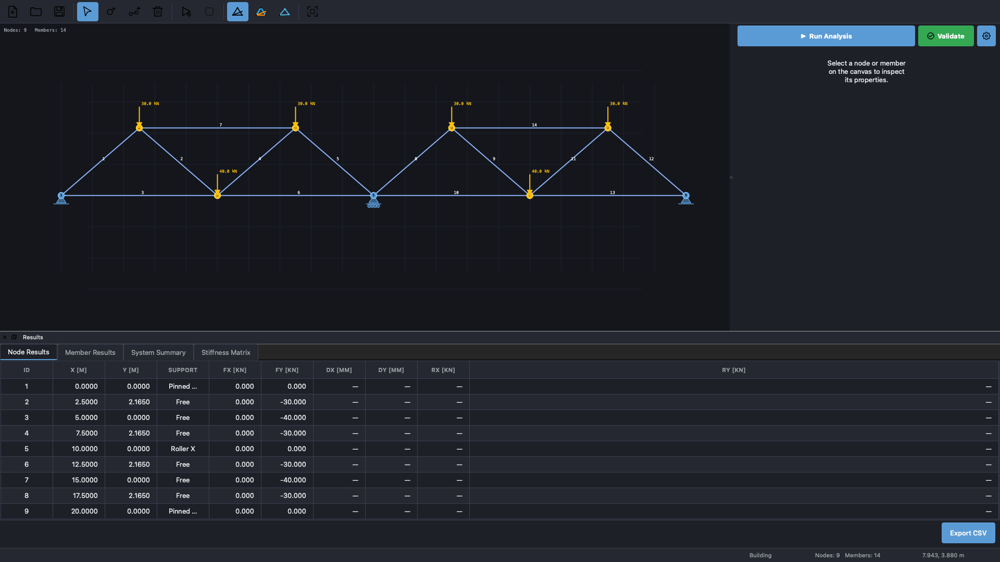
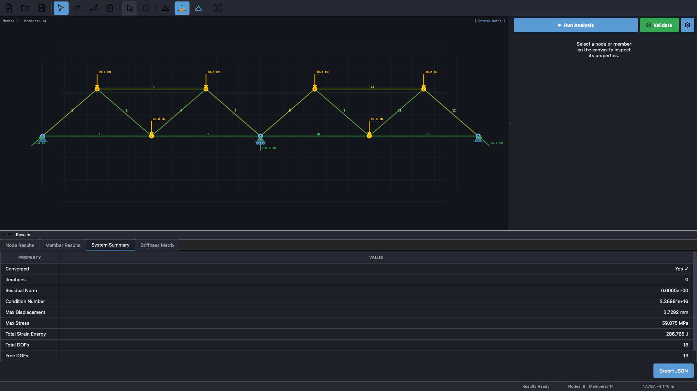
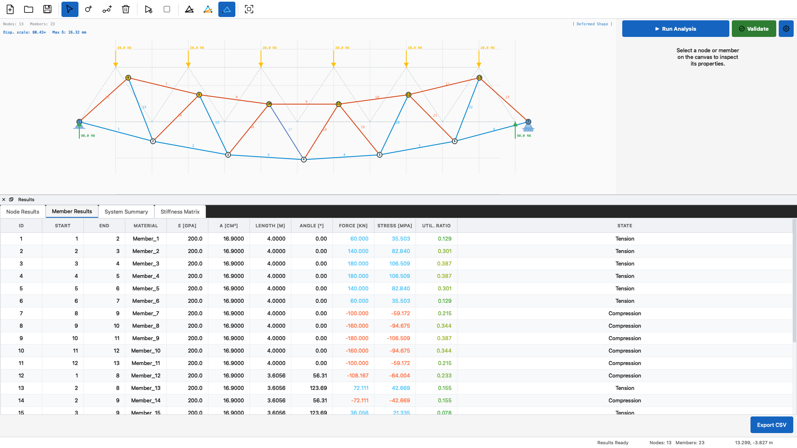
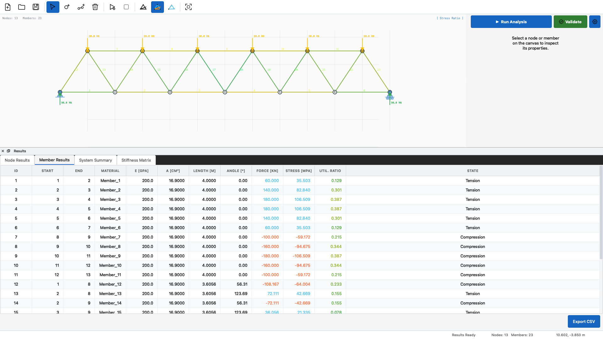

# 2D Truss Analysis

[](https://github.com/blackbird410/2D-Truss-Analysis/releases)
[](LICENSE)
[](https://www.linux.org/)
[](https://www.qt.io/)
[](https://isocpp.org/)
[](tests/)

A professional 2D plane truss structural analysis tool for Linux, built with C++20 and Qt6. Supports interactive model construction, direct stiffness method analysis, deformed shape and stress-ratio visualisation, and multi-format export — available as both a desktop GUI and a scriptable CLI.

## Features

**Interactive Drawing Canvas**

- Mouse-driven node and member placement with grid snapping (0.25 m)
- Select, move, and delete elements via click or `Delete` key
- Zoom with mouse wheel; pan with `Space` + drag
- Display modes: Geometry, Stress Ratio (colour-mapped), Deformed Shape (auto-scaled)
- Real-time member colour coding: tension (blue), compression (orange), yield (red)

**Keyboard Shortcuts**

| Key      | Action                  |
| -------- | ----------------------- |
| `N`      | Add Node mode           |
| `M`      | Add Member mode         |
| `Esc`    | Select mode             |
| `Delete` | Delete selected element |
| `Ctrl+S` | Save project            |
| `Ctrl+O` | Open project            |
| `Ctrl+N` | New project             |
| `F5`     | Run analysis            |
| `Z`      | Zoom to fit             |

**Analysis Engine**

- Direct stiffness method for statically determinate plane trusses
- Pinned, roller-X, and roller-Y boundary condition support
- Automatic stability validation (static determinacy check)
- Material and cross-section property management per member
- Output: node displacements, support reactions, member forces, stresses, utilisation ratios

**Results and Export**

- Results panels: Node Results, Member Results, System Summary, Stiffness Matrix
- Export to JSON, XML, CSV, TSV, TXT, HTML, LaTeX
- Export from both CLI and GUI

**Technology Stack**

| Component      | Technology                            |
| -------------- | ------------------------------------- |
| Language       | C++20                                 |
| GUI Framework  | Qt6 (Core, Widgets, Svg)              |
| Linear Algebra | Eigen3                                |
| Serialisation  | nlohmann-json, tinyxml2               |
| Testing        | Google Test + GoogleMock (1603 tests) |
| Build System   | CMake 3.20+, Makefile wrapper         |
| Platform       | Linux (x86_64, ARM64)                 |

## Screenshots

| Geometry Editor                                                                                                                                             | Stress Ratio Visualisation                                                                                                   |
| ----------------------------------------------------------------------------------------------------------------------------------------------------------- | ---------------------------------------------------------------------------------------------------------------------------- |
|  |  |

| Deformed Shape & Stiffness Matrix                                                                                                           | Member Analysis Results                                                                                                                                                       |
| ------------------------------------------------------------------------------------------------------------------------------------------- | ----------------------------------------------------------------------------------------------------------------------------------------------------------------------------- |
|  |  |

## Architecture Overview

The codebase follows Clean Architecture with strict layer separation and interface-based dependency injection:

```
┌─────────────────────────────────────────────────────────┐
│                    Presentation Layer                   │
│  (GUI: Qt6 Widgets, MVC Controllers, Qt Item Models)    │
└────────────────────┬────────────────────────────────────┘
                     │ DTOs, Interfaces
┌────────────────────▼────────────────────────────────────┐
│                   Application Layer                     │
│     (Services, Facades, Use Cases, DTOs, Results)       │
└────────────────────┬────────────────────────────────────┘
                     │ Domain Models
┌────────────────────▼────────────────────────────────────┐
│                     Domain Layer                        │
│  (Entities: Truss, Node, Member; Analysis; Validation)  │
└────────────────────┬────────────────────────────────────┘
                     │ Interfaces
┌────────────────────▼────────────────────────────────────┐
│                 Infrastructure Layer                    │
│        (File I/O, Export, Logging, Persistence)         │
└─────────────────────────────────────────────────────────┘
```

The GUI follows Qt MVC: `MainWindowController` coordinates five sub-controllers (`Canvas`, `Inspector`, `Analysis`, `Project`, `Export`) through the `ITrussAnalysisFacade` interface, which supports full unit-test coverage via `MockTrussAnalysisFacade`. The GUI never touches domain entities directly — all data is transferred via `NodeView`/`MemberView` DTOs.

See [docs/architecture/](docs/architecture/) for full architectural documentation.

## Requirements

| Dependency    | Version                      |
| ------------- | ---------------------------- |
| CMake         | 3.20+                        |
| C++ compiler  | GCC 10+ or Clang 10+ (C++20) |
| Qt6           | Core, Widgets, Svg           |
| Eigen3        | any recent                   |
| nlohmann-json | any recent                   |
| tinyxml2      | any recent                   |
| Linux         | Ubuntu 22.04+, Fedora, Arch  |

## Quick Start

### Makefile Wrapper (Recommended)

```bash
# Quick build (uses optimised defaults)
make build

# Run all tests
make test

# Generate coverage report
make coverage

# Install system-wide
sudo make install

# List all targets
make help
```

### Direct CMake Build

> This project targets Linux only. Windows and macOS are not supported.

```bash
# Ubuntu/Debian
sudo apt-get install cmake build-essential \
  qt6-base-dev qt6-svg-dev \
  libeigen3-dev nlohmann-json3-dev libtinyxml2-dev

# Fedora/RHEL
sudo dnf install cmake gcc-c++ \
  qt6-qtbase-devel qt6-qtsvg-devel \
  eigen3-devel nlohmann-json-devel tinyxml2-devel

# Arch Linux
sudo pacman -S cmake gcc qt6-base qt6-svg eigen nlohmann-json tinyxml2
```

```bash
git clone https://github.com/blackbird410/2D-Truss-Analysis.git
cd 2D-Truss-Analysis
cmake -B build -DCMAKE_BUILD_TYPE=Release
cmake --build build --parallel
ctest --test-dir build --output-on-failure --parallel
sudo cmake --install build   # optional
```

### Docker Deployment

```bash
# Production: CLI-only image (~125 MB)
make docker-build
make docker-run

# Development: full Qt6 toolchain image (~1.9 GB)
make docker-build-dev
make docker-dev
```

See [docker/README.md](docker/README.md) for full Docker usage.

## Usage

### GUI Application

Run from the repository root after build:

```bash
./build/src/gui/truss-analysis
```

After system install:

```bash
truss-analysis
```

### Command Line Interface

```bash
# Built-in help
./build/src/cli/truss-analysis-cli --help

# Run the built-in example truss
./build/src/cli/truss-analysis-cli example
./build/src/cli/truss-analysis-cli -v example

# Analyse a truss from file
./build/src/cli/truss-analysis-cli analyze --file truss.json
./build/src/cli/truss-analysis-cli analyze --file truss.json --output results.json
./build/src/cli/truss-analysis-cli analyze --file truss.json --output results.xml --format XML

# Validate without analysis
./build/src/cli/truss-analysis-cli validate --file truss.json

# Export results
./build/src/cli/truss-analysis-cli export --truss truss.json --results analysis.json --output report.html
./build/src/cli/truss-analysis-cli export --truss truss.json --results results.json --output report.tex --format LaTeX
```

After system install, replace `./build/src/cli/truss-analysis-cli` with `truss-analysis-cli`.

**Commands:** `example` · `analyze` · `validate` · `export` · `help`

**Input formats:** JSON, XML, CSV  
**Output formats:** JSON, XML, CSV, TSV, TXT, HTML, LaTeX

## Development

**Testing:**

```bash
# Run all tests
ctest --test-dir build --output-on-failure --parallel

# Run a specific suite
ctest --test-dir build -R unit_tests --output-on-failure

# Verbose output
ctest --test-dir build --verbose
```

**Coverage:**

```bash
make coverage   # generates HTML report in build/coverage/
```

**Code quality:**

```bash
make format     # clang-format + prettier
make lint       # clang-tidy
```

The GUI is extended by implementing a new controller that takes `ITrussAnalysisFacade&` and composing it into `MainWindowController`. All controllers are fully unit-testable via `MockTrussAnalysisFacade`. See [docs/architecture/gui-architecture.md](docs/architecture/gui-architecture.md) for the pattern.

## Documentation

| Document                                                   | Description                                         |
| ---------------------------------------------------------- | --------------------------------------------------- |
| [System Overview](docs/architecture/system-overview.md)    | Architecture, CMake targets, technology stack       |
| [Module Structure](docs/architecture/module-structure.md)  | Per-layer component descriptions                    |
| [GUI Architecture](docs/architecture/gui-architecture.md)  | Qt MVC design, controllers, signal/slot conventions |
| [Development Guide](docs/development/development-guide.md) | Build, test, coverage, CI/CD workflows              |

## Contributing

Contributions are welcome. Please follow the [Conventional Commits](https://www.conventionalcommits.org/) specification:

| Prefix   | Purpose                            |
| -------- | ---------------------------------- |
| `feat:`  | New feature                        |
| `fix:`   | Bug fix                            |
| `docs:`  | Documentation only                 |
| `style:` | Formatting, no logic change        |
| `test:`  | Test additions or corrections      |
| `build:` | Build system or dependency changes |

See [CONTRIBUTING.md](CONTRIBUTING.md) for full contribution guidelines.

## Related Projects

- [2D Truss Analysis (Python)](https://github.com/blackbird410/2D_Truss_Analysis) — original Python implementation

## License

MIT License. See [LICENSE](LICENSE) for details.
